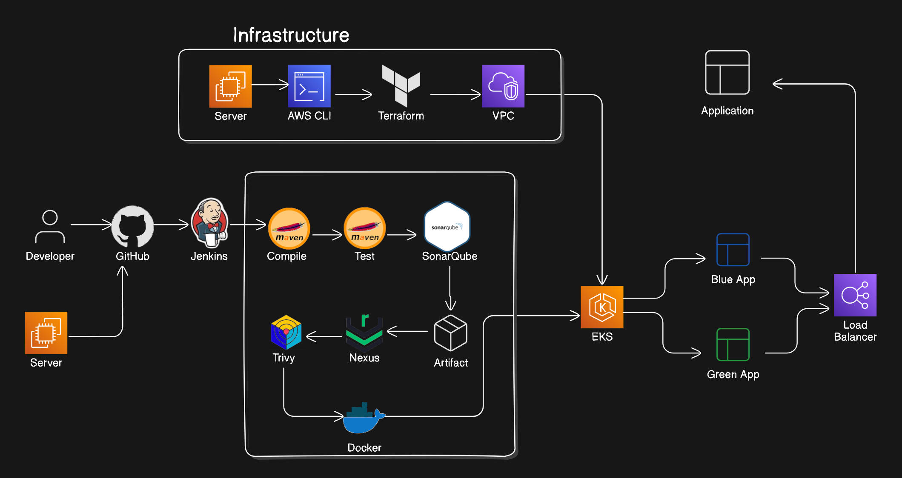
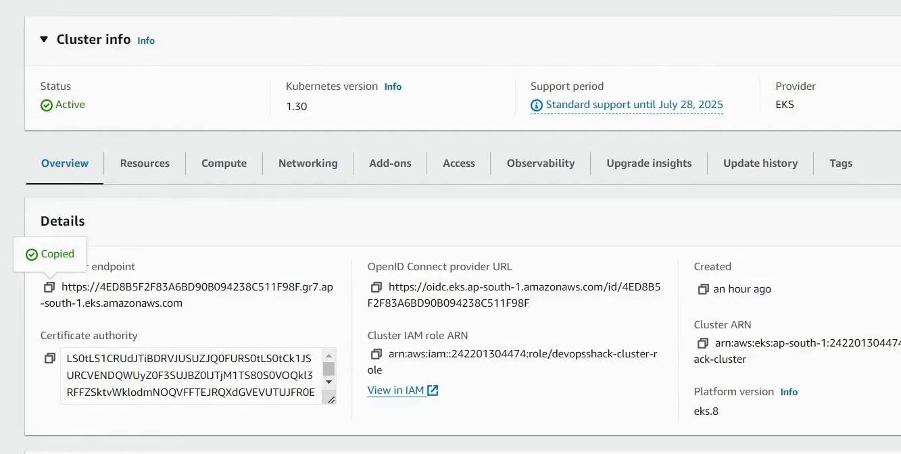
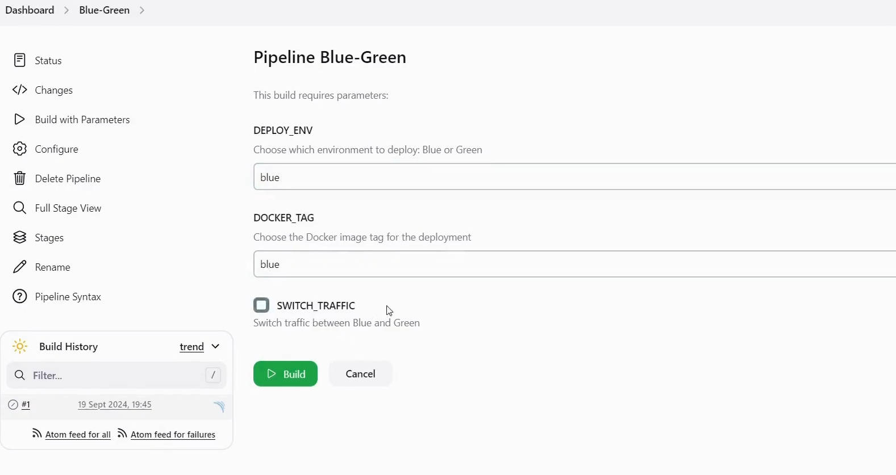
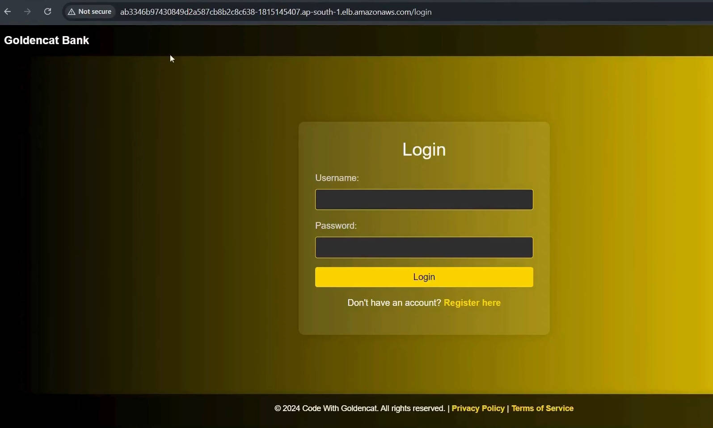

# Blue-Green Deployment using Jenkins and Kubernetes on EKS with Terraform

This project demonstrates a Blue-Green Deployment strategy for an application running on a Kubernetes cluster (EKS) provisioned using Terraform. It includes setting up CI/CD pipelines with Jenkins, code quality analysis using SonarQube, artifact management with Nexus, and deployment on Kubernetes.

## Project Overview

This project outlines the steps to set up a Blue-Green Deployment strategy using Jenkins and Kubernetes on an Amazon EKS cluster, provisioned with Terraform. It integrates several DevOps tools for automation, code quality checks, and artifact management.



### Steps Involved

1. **Set up EKS Cluster using Terraform**  
   Provision an Amazon EKS cluster using Terraform to handle infrastructure as code (IaC) for scaling and modifying the cluster.

3. **Set up Jenkins, SonarQube, and Nexus**  
   Jenkins is used to manage CI/CD pipelines, SonarQube is integrated for static code analysis, and Nexus is configured to store build artifacts.

4. **Set up Kubernetes RBAC**  
   Configure Role-Based Access Control (RBAC) to manage access to Kubernetes resources, ensuring secure communication between Jenkins, developers, and the cluster.

5. **Create a Blue-Green Deployment Pipeline in Jenkins**  
   The Jenkins pipeline automates building the application, performing code quality checks, deploying to the Green environment, testing, and switching traffic from Blue to Green.

## Key Tools

- **Terraform**: Provision EKS cluster.
- **Jenkins**: CI/CD tool for automating the deployment pipeline.
- **SonarQube**: Code quality management.
- **Nexus**: Artifact repository manager.
- **Kubernetes**: Orchestration for containerized deployment with a Blue-Green strategy.
- **AWS EKS**: Amazon's managed Kubernetes service.

## Benefits of Blue-Green Deployment

- **Efficient resource usage** by switching environments without rebuilding the system.
- **Rapid rollbacks** by switching back to the previous stable environment in case of issues.
- **Improved testing** in a production-like environment before going live.
- **Reduced risk** by isolating environments.
- **Controlled releases** for gradual deployment with minimal risk.

---

## Installation Commands

## Jenkins Installation

```bash
sudo wget -O /usr/share/keyrings/jenkins-keyring.asc https://pkg.jenkins.io/debian-stable/jenkins.io-2023.key
echo "deb [signed-by=/usr/share/keyrings/jenkins-keyring.asc] https://pkg.jenkins.io/debian-stable binary/" | sudo tee /etc/apt/sources.list.d/jenkins.list > /dev/null
sudo apt-get update
sudo apt-get install jenkins
```

## Check Jenkins Status

```bash
sudo systemctl status jenkins
```

# Trivy Installation

```bash
sudo apt-get install wget apt-transport-https gnupg lsb-release
wget -qO - https://aquasecurity.github.io/trivy-repo/deb/public.key | sudo apt-key add -
echo deb https://aquasecurity.github.io/trivy-repo/deb $(lsb_release -sc) main | sudo tee -a /etc/apt/sources.list.d/trivy.list
sudo apt-get update
sudo apt-get install trivy
```

# Docker Installation

```bash
sudo apt-get update
sudo apt-get install ca-certificates curl
sudo install -m 0755 -d /etc/apt/keyrings
sudo curl -fsSL https://download.docker.com/linux/debian/gpg -o /etc/apt/keyrings/docker.asc
sudo chmod a+r /etc/apt/keyrings/docker.asc
echo "deb [arch=$(dpkg --print-architecture) signed-by=/etc/apt/keyrings/docker.asc] https://download.docker.com/linux/debian $(. /etc/os-release && echo "$VERSION_CODENAME") stable" | sudo tee /etc/apt/sources.list.d/docker.list > /dev/null
sudo apt-get update
sudo apt-get install docker-ce docker-ce-cli containerd.io docker-buildx-plugin docker-compose-plugin
```

## Test Docker

```bash
sudo docker run hello-world
```

# Docker Configuration for Jenkins

```bash
sudo usermod -aG docker jenkins
sudo systemctl restart docker
sudo chmod 666 /var/run/docker.sock
```

# Install and Run SonarQube

```bash
sudo docker run -itd --name sonar -p 9000:9000 sonarqube
```

# Install and Run Nexus Server to Store Artifacts

```bash
sudo docker run -d -p 8081:8081 --name nexus sonatype/nexus3
```

# AWS CLI Installation

```bash
curl "https://awscli.amazonaws.com/awscli-exe-linux-x86_64.zip" -o "awscliv2.zip"
unzip awscliv2.zip
sudo ./aws/install
```

## AWS Configuration

```bash
aws configure
```

## EKSCtl Installation

```bash
curl -sLO "https://github.com/eksctl-io/eksctl/releases/latest/download/eksctl_$PLATFORM.tar.gz"
tar -xzf eksctl_$PLATFORM.tar.gz -C /tmp && rm eksctl_$PLATFORM.tar.gz
sudo mv /tmp/eksctl /usr/local/bin
```

## Kubectl Installation

```bash
curl -LO "https://dl.k8s.io/release/$(curl -L -s https://dl.k8s.io/release/stable.txt)/bin/linux/amd64/kubectl"
curl -LO "https://dl.k8s.io/release/$(curl -L -s https://dl.k8s.io/release/stable.txt)/bin/linux/amd64/kubectl.sha256"
echo "$(cat kubectl.sha256)  kubectl" | sha256sum --check
sudo install -o root -g root -m 0755 kubectl /usr/local/bin/kubectl
kubectl version --client
```

## Connect to EKS Cluster

```bash
aws eks --region <region-code> update-kubeconfig --name <cluster-name>
```

## Snapshots of the Project
## AWS EKS Cluster


## Jenkins Pipeline Stages


## Jenkins Blue Green Deployment Build with Parameters


## Live Application


